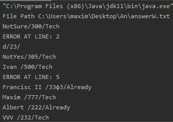
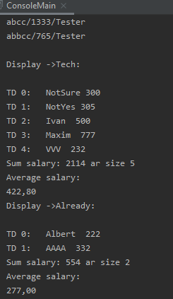
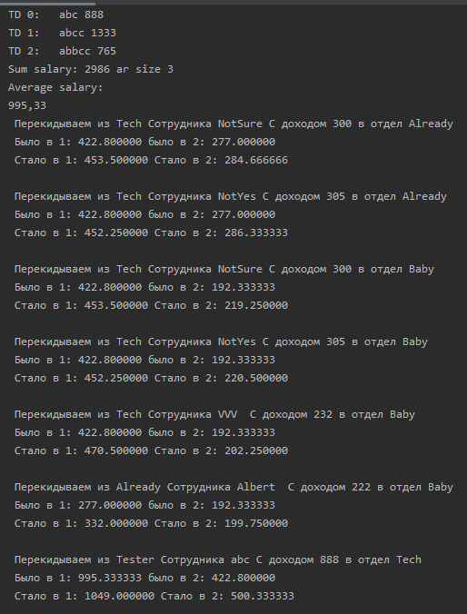

# Squad_reader
Задача:
 - Написать программу, которая читает из файла информацию о сотрудниках и их принадлежности к отделам, 
рассчитывает среднюю зарплату сотрудников в отделе, строит и выводит в файл все варианты возможных 
переводов сотрудников из одного отдела в другой, при которых средняя зарплата увеличивается в обоих отделах.

Файл для ознакомления со списком сотрудников: 
https://github.com/samurayrus/Squad_reader/blob/Rabotnik_OBJ/Proj_read/squads.txt
Файл для ознакомления с результатом работы программы: 
https://github.com/samurayrus/Squad_reader/blob/Rabotnik_OBJ/Proj_read/SquadTransfer.txt

Пример работы программы:
 - Выводится в консоль путь до файла с результатами работы программы. Путь можно прописать вручную, подав его вторым аргументом (если этого не сделать, то файл создастся в дефолтной дирректории с указанием пути).
Первым аргументом указывается путь до файла с сотрудниками.

 - Построчное считывание файла и вывод в консоль.
Если строка имела некорректную запись, то в консоли выводится ошибка, номер строки и сама строка, с которой возникла проблема.
На скриншоте видно несколько таких моментов.

 
 
 - Программа в реальном времени записывает новых сотрудников и распределяет их по отделам/создает новые отделы, а по окончании работы запрашивает у каждого отдела информацию о содержимом (Название отдела, Сотрудники, заработок суммарный и каждого в частности, средний доход отдела)
 
 
 
 - В консоль выводится информация о возможных переводах сотрудников между двумя отделами, при условии, что средний доход вырастет у обоих отделов.
 Эта информация выводится как в консоль, так и записывается в файл после каждого найденного решения.
 
 

