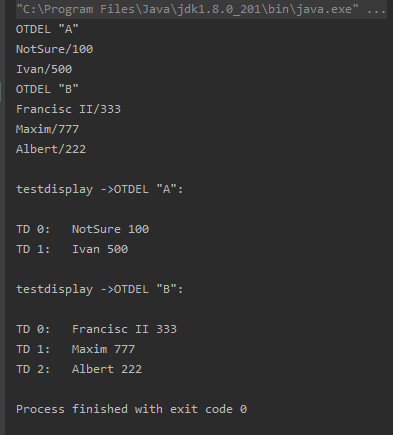

# Squad_reader
Написать программу, которая читает из файла информацию о сотрудниках и их принадлежности к отделам, рассчитывает среднюю зарплату сотрудников в отделе, строит и выводит в файл все варианты возможных переводов сотрудников из одного отдела в другой, при которых средняя зарплата увеличивается в обоих отделах.

Пример работы программы:
Сначала считываение, затем каждый отдел отчитывается о содержащихся в нем сотрудниках
 

